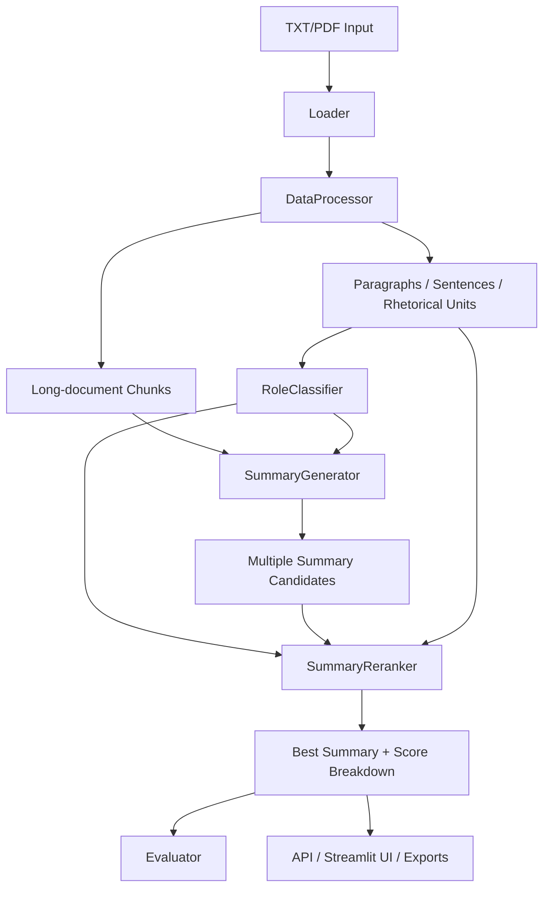

# Legal Argument-Aware Summarization MVP

Research-grade MVP for long-form legal document summarization, inspired by the ACL Findings 2023 paper _“Towards Argument-Aware Abstractive Summarization of Long Legal Opinions with Summary Reranking.”_

This project builds a realistic local pipeline for court judgments and legal opinions that:

- ingests TXT and PDF documents,
- segments them into paragraphs, sentences, and approximate argumentative units,
- predicts rhetorical roles,
- generates multiple abstractive summary candidates,
- reranks those candidates with argument-structure-aware scoring,
- returns the best summary with metrics and interpretable reasoning.

The implementation is designed to stay runnable on commodity machines, with CPU-safe defaults and heuristic fallbacks when heavyweight legal models are unavailable locally.

## Why This Matters

Legal opinions are long, structurally dense, and argument-heavy. A plain summarizer often misses the court’s actual reasoning path: what facts mattered, what issue was being decided, what law controlled, and what the disposition was. This MVP explicitly models rhetorical structure so the final summary is not chosen only for fluency, but also for role coverage and legal usefulness.

## Features

- Open-source-only stack built around Hugging Face models and local libraries
- Long-document handling with chunking and merge-style summarization
- Hybrid rhetorical-role prediction:
  - transformer prototype classification when legal encoders are available
  - heuristic weak-labeling fallback when they are not
- Multi-candidate summary generation with several role-aware strategies
- Config-driven reranking with semantic, structural, factual, and redundancy signals
- Automatic evaluation with ROUGE and BERTScore
- FastAPI backend
- Streamlit interface
- Training, preprocessing, demo, and evaluation scripts
- Synthetic Indian and U.S. legal sample documents

## Architecture



## Repository Layout

```text
.
├── README.md
├── requirements.txt
├── .env.example
├── configs/
├── data/
├── notebooks/
├── scripts/
├── src/
├── app/
├── tests/
└── Dockerfile
```

## Setup

### 1. Create an environment

```bash
python -m venv .venv
. .venv/bin/activate
pip install -r requirements.txt
```

On Windows PowerShell:

```powershell
python -m venv .venv
.venv\Scripts\Activate.ps1
pip install -r requirements.txt
```

### 2. Optional environment variables

Copy `.env.example` to `.env` and adjust paths or runtime flags if needed.

Important runtime toggles:

- `DEVICE=cpu`
- `LOCAL_FILES_ONLY=true`
- `USE_HEURISTICS_ONLY=true`

These are useful for fully local or offline operation.

## Running The API

```bash
uvicorn app.api:app --host 0.0.0.0 --port 8000
```

Interactive docs will be available at:

- `http://localhost:8000/docs`

## Running Streamlit

```bash
streamlit run app/streamlit_app.py
```

The Streamlit app now opens with a local email/password sign-in screen. Accounts are stored on the local machine with salted PBKDF2-HMAC-SHA256 password hashes.

## Running The Demo

```bash
python scripts/run_demo.py --input-path data/demo/indian_judgment_sample.txt
python scripts/run_demo.py --input-path data/demo/us_opinion_sample.txt
```

## Training The Role Classifier

The project works without a trained classifier, but you can train one when sentence-level labels are available.

```bash
python scripts/train_role_classifier.py \
  --dataset-path data/samples/legal_samples.json \
  --allow-weak-labels
```

Notes:

- If your dataset already contains aligned sentence-level labels, do not use `--allow-weak-labels`.
- By default, the script fine-tunes a Hugging Face encoder for sequence classification.
- Weak labels are generated from the heuristic role labeler when gold labels are missing.

## Preprocessing A Dataset

```bash
python scripts/preprocess_data.py \
  --input-path data/samples/legal_samples.json \
  --output-path data/processed/preprocessed_dataset.jsonl
```

## Running Evaluation

```bash
python scripts/evaluate_model.py \
  --dataset-path data/samples/legal_samples.json \
  --output-path data/processed/evaluation_metrics.json
```

## Testing

```bash
pytest
```

## Models

### Summarization

- Preferred: `allenai/led-base-16384`
- Fallback: `facebook/bart-large-cnn`
- Lightweight fallback: `google/flan-t5-base`

### Rhetorical-role classification

- Preferred: `law-ai/InLegalBERT`
- Alternative: `nlpaueb/legal-bert-base-uncased`
- Lightweight fallback: `distilbert-base-uncased`

### Embeddings for reranking

- `sentence-transformers/all-MiniLM-L6-v2`

## API Overview

### `POST /upload-pdf`

Accepts a PDF upload and extracts text with metadata.

Example:

```bash
curl -X POST "http://localhost:8000/upload-pdf" \
  -F "file=@data/demo/sample.pdf"
```

### `POST /summarize`

Input:

```json
{
  "document_id": "case-001",
  "document_text": "Facts: ... Issue: ... Analysis: ... Ruling: ...",
  "gold_summary": "Optional gold summary"
}
```

Output shape:

```json
{
  "document_id": "case-001",
  "predicted_roles": [],
  "generated_summary_candidates": [],
  "reranking_scores": [],
  "best_summary": "..."
}
```

### `POST /evaluate`

Two supported modes:

1. Direct summary evaluation

```json
{
  "generated_summary": "The court remanded the matter.",
  "gold_summary": "The court set aside the order and remanded the case."
}
```

2. End-to-end evaluation from source document

```json
{
  "document_id": "case-001",
  "document_text": "Facts: ...",
  "gold_summary": "Reference summary..."
}
```

## Streamlit UI

The UI supports:

- local sign-in and account creation with hashed passwords
- TXT/PDF upload
- extracted text preview
- rhetorical-unit table with predicted roles and confidence
- top candidate inspection
- reranking score inspection
- best-summary display
- optional gold-summary evaluation
- Markdown, JSON, and PDF report export

## Core Modules

### `DataProcessor`

- text normalization
- citation cleanup
- section-header normalization
- paragraph segmentation
- sentence segmentation
- approximate rhetorical-unit segmentation
- chunking for long documents
- source-span preservation for explainability

### `RoleClassifier`

- `predict(segment)`
- `predict_batch(segments)`
- transformer prototype-based classification when models are present
- heuristic weak-label fallback based on headers, cue phrases, and regex

### `SummaryGenerator`

Creates multiple candidate summaries using:

- baseline full-document input
- facts + issue + ruling emphasis
- analysis-heavy input
- chunk-and-merge conservative decoding
- chunk-and-merge diverse decoding

### `SummaryReranker`

Weighted reranking using:

- semantic similarity
- rhetorical-role coverage
- factual consistency proxies
- redundancy penalty
- length penalty
- readability bonus

### `Evaluator`

- ROUGE-1
- ROUGE-2
- ROUGE-L
- BERTScore
- qualitative analysis and candidate comparison

### `LegalSummarizationPipeline`

Single orchestrator for preprocessing, role prediction, generation, reranking, evaluation, and explainability.

## Sample Data

Included demo files:

- `data/demo/indian_judgment_sample.txt`
- `data/demo/us_opinion_sample.txt`
- `data/samples/legal_samples.json`
- `data/samples/legal_samples.csv`

For PDF experiments, add your own legal PDF into `data/demo/` or upload one through the API/UI.

## What Is Faithful To The Paper vs What Is Pragmatic Adaptation

### Faithful to the paper

- The overall pipeline follows the same high-level intuition:
  - structure-aware processing of long legal opinions
  - multiple summary candidates rather than a single decode
  - reranking that uses argument/rhetorical structure rather than plain generation likelihood alone
- The reranker explicitly rewards coverage of legally salient rhetorical roles.
- The system treats long opinions differently from short texts by using chunking and merge-style processing.

### Pragmatic adaptation for an MVP

- The original paper uses research-specific training setups and datasets that are not fully reproduced here.
- Instead of requiring a fully supervised rhetorical-role model, this MVP uses a hybrid approach:
  - transformer encoder similarity to label prototypes
  - heuristic weak-label fallback
- The summarizer uses available Hugging Face seq2seq models and heuristic fallback rather than the exact research training recipe.
- The reranking score uses practical proxies for faithfulness and coverage:
  - embedding similarity
  - citation/entity/number overlap
  - role coverage heuristics
  - redundancy and length penalties

### Why these approximations were chosen

- They keep the system runnable on local hardware.
- They avoid dependence on paid APIs or proprietary models.
- They preserve the main research idea, especially argument-aware candidate selection, while remaining reproducible and production-oriented.

## Limitations

- Exact reproduction of the ACL paper’s experimental setup is out of scope for this MVP.
- Without a fine-tuned rhetorical-role classifier, predictions rely on prototype similarity and heuristics.
- When Hugging Face models are not cached locally, first-time downloads may be large.
- Heuristic fallback summaries are controllable and robust, but less fluent than a successfully loaded LED/BART/T5 model.
- PDF extraction quality depends on source formatting and whether the PDF is text-based.

## Future Improvements

- Fine-tune on a larger legal rhetorical-role dataset with richer segment annotations
- Add stronger legal-domain factuality checks
- Improve citation grounding and sentence-to-source attribution
- Add jurisdiction-specific prompt templates and scoring rules
- Add richer PDF layout parsing and table handling
- Extend to benchmark datasets for reproducible paper-style experiments

## Recommended Local Workflow

1. Start with `USE_HEURISTICS_ONLY=true` if you want guaranteed local execution.
2. Cache the preferred Hugging Face models locally when you want stronger summaries.
3. Fine-tune the role classifier on your own labeled corpus for better reranking performance.
4. Use the API for integration and Streamlit for analyst-facing inspection.
